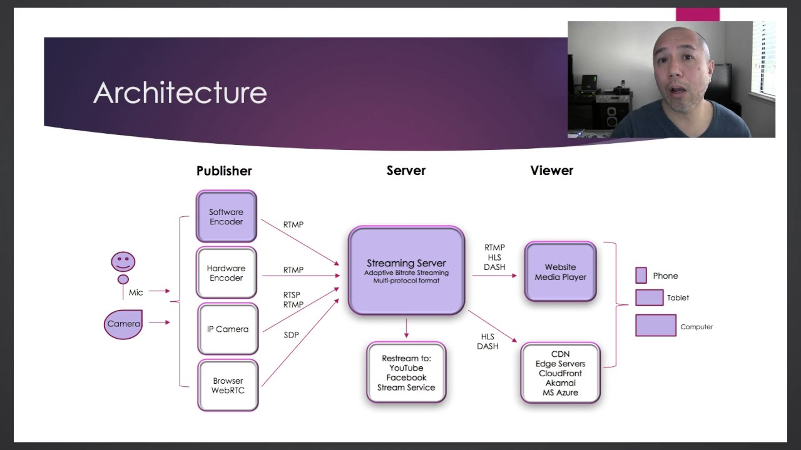

# sound-sharing-HLS
HLS Stream server, CDN

## Stream server architecture

Our stream server is implemented in nginx

Basically, we have our cdn stream content through ffmpeg. The cdn itself support endpoints to stream and end-stream its content